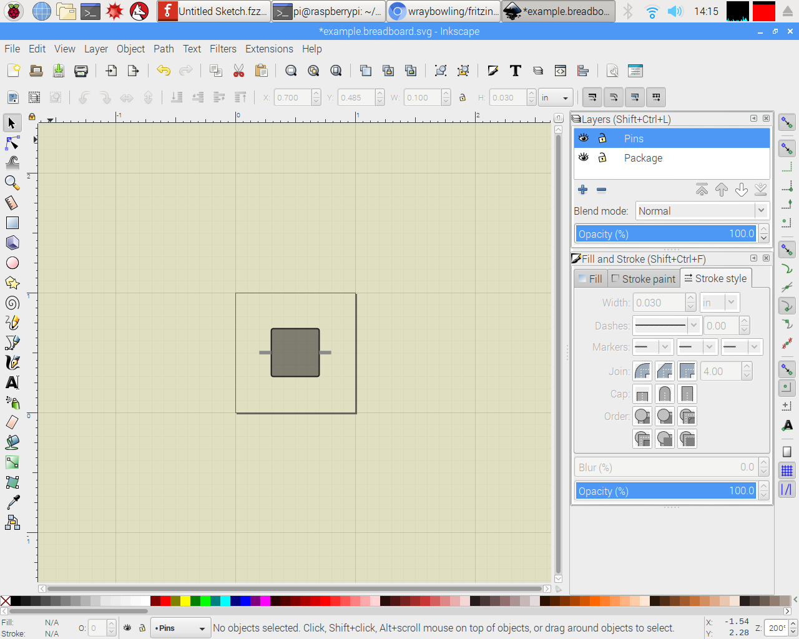
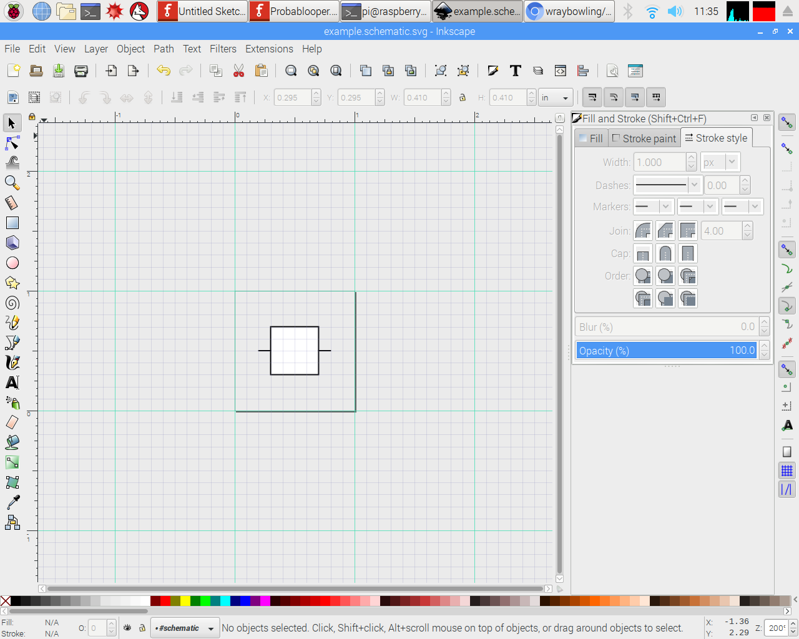

# Fritzing New Part Kit

Hello, human being. Are you interested in using Fritzing for a project, and just bumped into the fact that a part you'd like to use does not exist? That happens a lot, it turns out. It also turns out that the templates provided by fritzing.org, while well meaning, are pretty terrible. So I made new ones that are much better.

### What Am I supposed to do with these?
Open up each SVG in Inkscape. Design your part all three ways. Import your modified SVGs into Fritzing to assign pins and stuff like that.

## Features

### Breadboard

- a warm neutral background that mimicks the off-white of a breadboard
- all units set to inches
- a DIP grid that you can turn on or off
- snapping settings that make lining up with the grid excellent
- example box that gets the job done with minimal complexity
- pins made of single strokes
- pins on their own top layer so you won't have trouble selecting them later

### Schematic

- not-white background so you can see your white-filled shapes
- document units set to inches (no one explains these things)
- line width units in pixels (1px is the standard)
- 0.1in grid that actually matches the schematic view
- a boring default square you can use or delete
- a couple boring lines with rounded caps you can use, duplicate, or delete
- pins on their own layer so you won't have trouble selecting them later

### PCB
- see the major groups in the layers panel
- helper objects for drilling inside of front copper or rear copper
- lots of grids for various package sizes, all named

